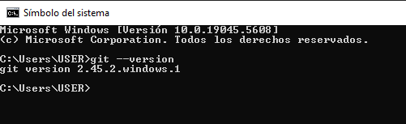
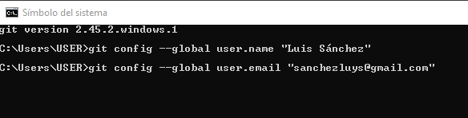

Instalaciones necesarias
========================

link youtube: [clase 0](https://www.youtube.com/watch?v=L5XtB1G2k9E&list=PLCKuOXG0bPi0sIn-nDsi7ma9OV6MEMkxj&index=4)

En este curso vamos a trabajar con Flutter, un framework de Google para desarrollar aplicaciones móviles multiplataforma. Para poder seguir este curso necesitarás tener instalado en tu ordenador:

Usar las guías de atajos para flutter y dark en el material de apoyo

- [x] [Visual Studio Code](https://code.visualstudio.com/)
- [x] [Flutter](https://flutter.dev/)   
- [x] [Dart](https://dart.dev/)
- [x] [Git](https://git-scm.com/)
- [x] [Android Studio](https://developer.android.com/studio)
- [x] [Xcode](https://developer.apple.com/xcode/)


## GIT

para validar que git esta instalado en tu sistema operativo, puedes ejecutar el siguiente comando en la terminal:

```bash
- [x] git --version
```


configurar el nombre de usuario y correo electrónico en git:

```bash
- [x] git config --global user.name "Tu nombre"
- [x] git config --global user.email "Tu correo"
``` 



Si no tienes git instalado, puedes descargarlo desde la página oficial: [Git](https://git-scm.com/)

## Visual Studio Code

Visual Studio Code es un editor de código fuente desarrollado por Microsoft para Windows, Linux y macOS. Incluye soporte para la depuración, control integrado de Git, resaltado de sintaxis, finalización inteligente de código, fragmentos y refactorización de código.

extensiones recomendadas para flutter y dart:

- [x] Activitus Bar
- [x] Awesome Flutter Snippets
- [x] Dart language
- [x] Error Lens
- [x] Paste JSON as Code
- [x] Pubspec Assist
- [x] Better Comments
- [x] Terminal
- [x] Bloc
- [x] Flutter support
- [x] Lorem ipsum


## Postman / Insomnia

Postman es una plataforma de colaboración para el desarrollo de API. Postman simplifica el proceso de desarrollo de API, lo que permite a los desarrolladores crear, compartir, probar y documentar fácilmente API.

Insomnia es una herramienta de código abierto que permite a los desarrolladores crear y probar solicitudes HTTP. Insomnia es una alternativa a Postman.

- [x] [Postman](https://www.postman.com/)
- [x] [Insomnia](https://insomnia.rest/)


## Android Studio

Android Studio es el entorno de desarrollo integrado oficial para la plataforma Android. Android Studio proporciona las herramientas más rápidas para crear aplicaciones para cualquier tipo de dispositivo Android.

## xCode

Xcode es un entorno de desarrollo integrado (IDE) para macOS que contiene un conjunto de herramientas creadas por Apple para desarrolladores de software. Xcode es el software de desarrollo oficial de Apple para crear aplicaciones para iOS, macOS, watchOS y tvOS.

## Flutter-SDK

Flutter es un framework de código abierto desarrollado por Google para crear aplicaciones para Android y iOS. Flutter utiliza el lenguaje de programación Dart.

[flutter instalar](https://docs.flutter.dev/get-started/install)

[flutter windows](https://storage.googleapis.com/flutter_infra_release/releases/stable/windows/flutter_windows_3.29.2-stable.zip)