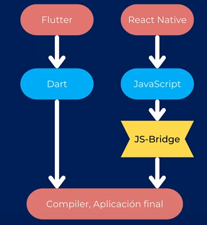

Que es Dart?
============

[S2/L01](https://www.youtube.com/watch?v=Lxx0FCjSkHY&list=PLCKuOXG0bPi0sIn-nDsi7ma9OV6MEMkxj&index=7)

Dart es un lenguaje de programación de código abierto, desarrollado por Google. Es un lenguaje orientado a objetos, fuertemente tipado y con una sintaxis similar a la de Java y JavaScript.

- esta al lado del cliente
- optimizado para aplicaciones
- Optimizado para el UI
- Permite el Hot Reload
- Rápido en todas las plataformas (ARM & x64)
- Features de programación asíncrona, async/await
- Código non-blocking
- Streams al abrirlo de la caja
- Toda aplicación de Dart ejecuta una función inicial llamada main(), el main puede ser sicrono o asincrono
- Sintaxis similar a Java y JavaScript, typescript, c#
- Curva de aprendizaje baja

