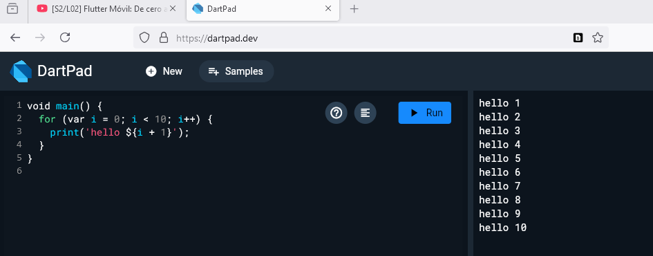

Hola mundo
==========

Dart se puede ejecutar en el navegador, en el link [dartpad](https://dartpad.dev/).

```dart
void main() {
  print('Hola mundo');
}
```



## tipos de dato:

- void: no retorna nada

## crear variables

```dart
void main() {
  var nombre = 'Juan';
  print(nombre);
  print('hola $nombre');
}
```

### se recomienda definir de manera explicita el tipo de dato

```dart
void main() {
  String nombre = 'Juan';
  print(nombre);
  print('hola $nombre');
}
```

### comentarios con doble barra o con barra y asterisco

```dart
void main() {
  // comentario de una linea
  /*
  comentario
  multilinea
  */
  String nombre = 'Juan';
  print(nombre);
  print('hola $nombre');
}
```

### variable final, similar a una constante pero no es igual

```dart
void main() {
  final String nombre = 'Juan';
  print(nombre);
  print('hola $nombre');
}
```

### inicialización tardía *late*

```dart
void main() {
  late String nombre;
  nombre = 'Juan';
  print(nombre);
  print('hola $nombre');
}
```

### definir constantes

```dart
void main() {
  const String nombre = 'Juan';
  print(nombre);
  print('hola $nombre');
}
```

>[!NOTE] constantes se agrega en tiempo de construcción: const
>[!NOTE] final se agrega en tiempo de ejecución

### Interpolación de cadenas

- los strings tienen propiedades y métodos
- se pueden concatenar con el signo +
- se pueden interpolar con el signo $
- se pueden interpolar con el signo ${}
- se pueden concatenar con el método toUpperCase()
- se pueden concatenar con el método toLowerCase()
- se pueden concatenar con el método trim()
- se pueden concatenar con el método length()
- se pueden concatenar con el método contains()
- se pueden concatenar con el método replaceAll()
- se pueden concatenar con el método split()
- se pueden concatenar con el método substring()
- se pueden concatenar con el método startsWith()
- se pueden concatenar con el método endsWith()
- se pueden concatenar con el método indexOf()
- se pueden concatenar con el método lastIndexOf()
- se pueden concatenar con el método padLeft()
- se pueden concatenar con el método padRight()
- se pueden concatenar con el método compareTo()
- se pueden concatenar con el método compareToIgnoreCase()
- se pueden concatenar con el método codeUnitAt()
- se pueden concatenar con el método runes()
- se pueden concatenar con el método codeUnits()
- se pueden concatenar con el método isEmpty()
- se pueden concatenar con el método isNotEmpty()
- se pueden concatenar con el método splitMapJoin()
- se pueden concatenar con el método replaceFirst()
- se pueden concatenar con el método replaceFirstMapped()
- se pueden concatenar con el método replaceRange()
- se pueden concatenar con el método replaceAllMapped()
- se pueden concatenar con el método replaceFirstMapped()


```dart 
void main() {
  String nombre = 'Juan';
  print('hola $nombre');
  print('hola ${nombre.toUpperCase()}');
}
```

### los nombres de los archivos deben ser en minúsculas y separados por guiones bajos

ejemplo usa snake_case

>[!NOTE] 01_hello_world.dart
