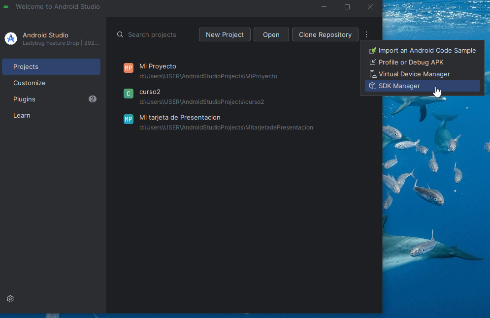
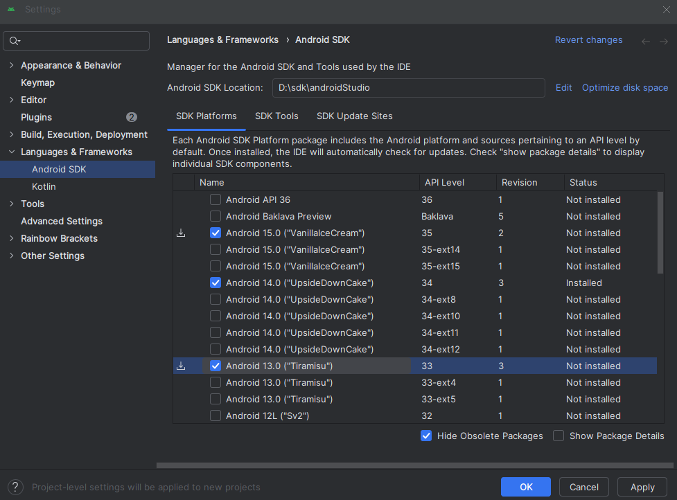
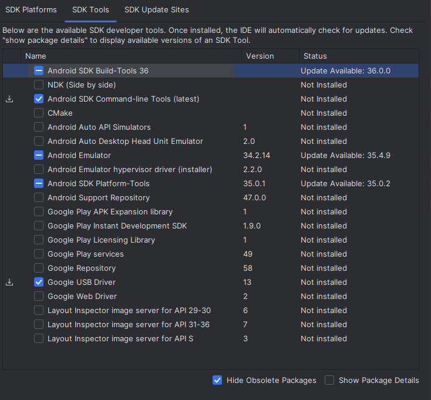
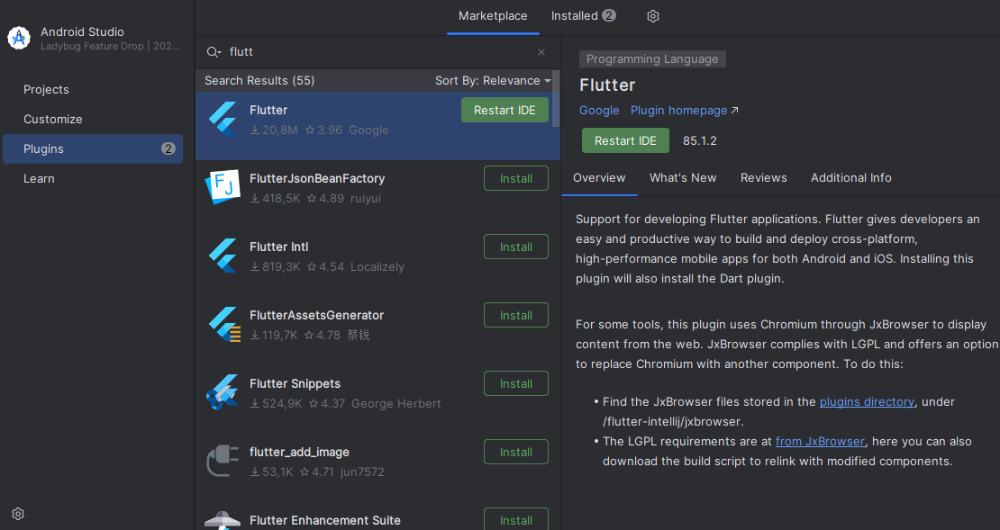

Instalando Visual studio en Windows
=========================

- [S3/L01](https://www.youtube.com/watch?v=0a0IGoNVo5k&list=PLCKuOXG0bPi0sIn-nDsi7ma9OV6MEMkxj&index=31)

## Requisitos previos

- Android SDK
- Android SDK command line tools
- Android SDK build tools
- Android Studio

1. Instalando Android Studio

- Descargar Android Studio desde la pagina oficial de Android Studio
- Instalar Android Studio siguiendo las instrucciones de la instalacion
- Abrir Android Studio y seguir las instrucciones para configurar el SDK de Android

- buscar el SDK Manager y abrirlo

- en la pestaña SDK Platforms, seleccionar la version de Android que se desea instalar (se recomienda la version mas reciente), no se recomiendan las versiones beta o preview

- en la pestaña SDK Tools, seleccionar las herramientas que se desean instalar (se recomienda instalar todas las herramientas disponibles), no se recomiendan las versiones beta o preview, instalar las indicadas en la imagen

- luego en plugins, buscar el plugin de Flutter y Dart, instalarlo y reiniciar Android Studio

