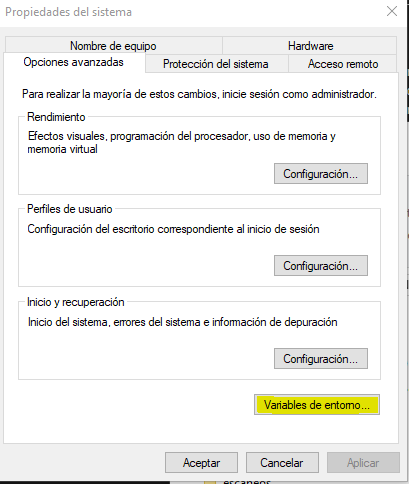
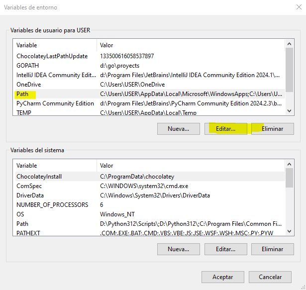
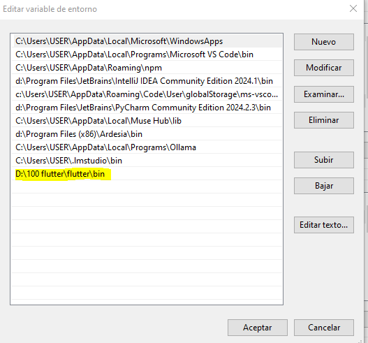
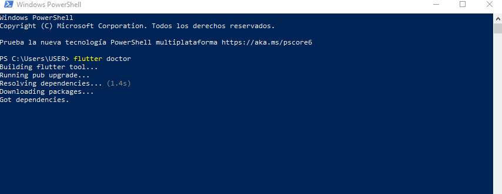
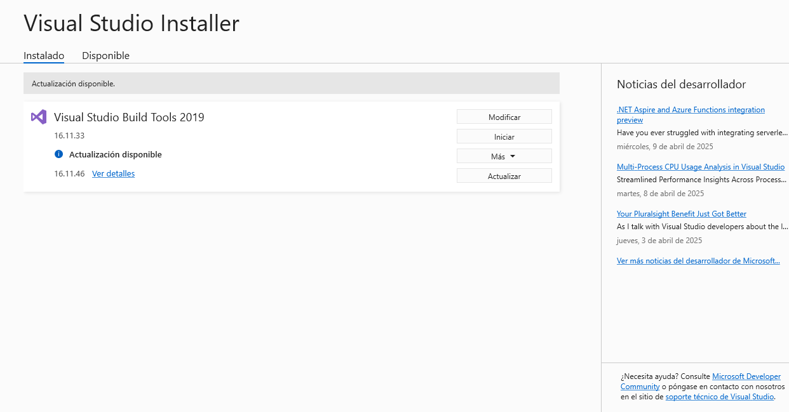
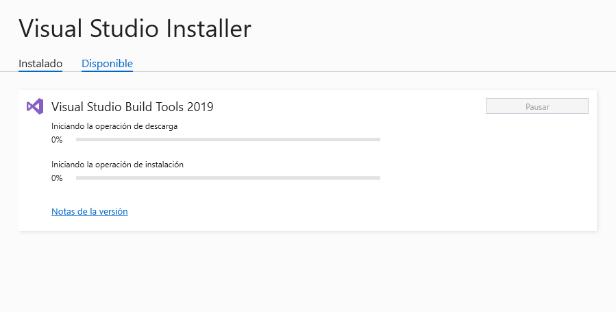
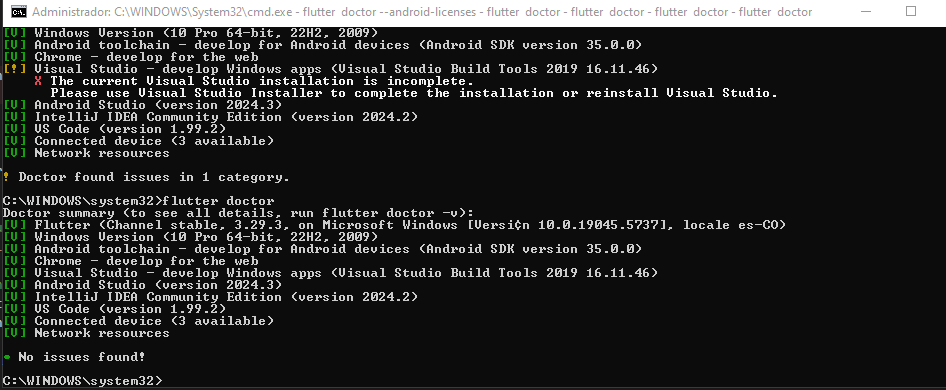

Windows Instalación Flutter
=========================


- [S3/L02](https://www.youtube.com/watch?v=ZlmuGrBE628&list=PLCKuOXG0bPi0sIn-nDsi7ma9OV6MEMkxj&index=32)

## Pre-requisitos

- Windows 10 o superior a 64 bits
- Espacio en disco de 1.64 GB (sin contar el espacio para Android Studio)
- Git (opcional, pero recomendado)
- Android Studio (opcional, pero recomendado)
- Visual Studio Code (opcional, pero recomendado)

1. ir a la página oficial de flutter: [flutter.dev](https://flutter.dev/docs/get-started/install/windows)
2. descargar el zip de flutter
3. descomprimir el zip en una carpeta de tu preferencia (ejemplo: C:\src\flutter)
4. agregar la carpeta flutter/bin a la variable de entorno PATH 
5. abrir una terminal de Windows (cmd) y ejecutar el comando `flutter doctor` para verificar la instalación


## Actualizar el path

windows->env









- luego en power shell ejecutar `flutter doctor`



## Muchos errores

- se uso chatgpt para poder resolver los errores
- gpt indica que en mi caso el sdk esta instalado en d: en otra ruta y es necesario correr un script para corregir que el flutter vea el sdk

```bat
@echo off
SET SDK_PATH=D:\sdk\androidStudio
SET CMDLINE_TOOLS=%SDK_PATH%\cmdline-tools
SET LATEST_PATH=%CMDLINE_TOOLS%\latest

echo Verificando carpeta del SDK en: %SDK_PATH%
IF NOT EXIST "%SDK_PATH%" (
    echo ❌ No se encuentra la ruta del SDK: %SDK_PATH%
    pause
    exit /b
)

echo ✔️ SDK encontrado

:: Verifica si hay una carpeta cmdline-tools dentro de latest (estructura incorrecta)
IF EXIST "%LATEST_PATH%\cmdline-tools\bin\sdkmanager.bat" (
    echo Corrigiendo estructura de cmdline-tools...
    move "%LATEST_PATH%\cmdline-tools\*" "%LATEST_PATH%" >nul
    rmdir "%LATEST_PATH%\cmdline-tools"
)

:: Agrega variable de entorno ANDROID_SDK_ROOT
echo Configurando ANDROID_SDK_ROOT...
setx ANDROID_SDK_ROOT "%SDK_PATH%" /M

:: Agrega sdkmanager al PATH si no está
echo Agregando sdkmanager al PATH...
set "PATH_LINE=%LATEST_PATH%\bin"
for /f "tokens=*" %%i in ('reg query "HKLM\SYSTEM\CurrentControlSet\Control\Session Manager\Environment" /v PATH ^| findstr /i "%PATH_LINE%"') do (
    set FOUND=1
)
IF NOT DEFINED FOUND (
    for /f "tokens=2*" %%a in ('reg query "HKLM\SYSTEM\CurrentControlSet\Control\Session Manager\Environment" /v PATH') do (
        set OLD_PATH=%%b
    )
    set NEW_PATH=%OLD_PATH%;%PATH_LINE%
    reg add "HKLM\SYSTEM\CurrentControlSet\Control\Session Manager\Environment" /v PATH /t REG_EXPAND_SZ /d "%NEW_PATH%" /f
    echo PATH actualizado.
)

echo Reiniciá la terminal o cerrá sesión para aplicar cambios del entorno.

echo.
echo Ejecutando: flutter doctor --android-licenses
cmd /k "flutter doctor --android-licenses"
```

dando todo ok!

luego queda el warning de herramientas para aplicaciones en windows,
de nuevo gpt genera un script para correr el visula studio installer y corregir el error:

```bat
@echo off
echo Instalando componentes necesarios de Visual Studio para desarrollo de apps Windows...
echo.

:: Abre el instalador de Visual Studio (asegúrate de tener el Visual Studio Installer instalado)
start "" "C:\Program Files (x86)\Microsoft Visual Studio\Installer\vs_installer.exe"

:: Espera que el usuario abra el instalador y seleccione "Modificar"
echo Por favor, asegúrate de seleccionar las siguientes opciones en el instalador:
echo - Desarrollo de escritorio con C++
echo - Windows 10 SDK
echo - Herramientas de compilación MSVC v142 o superior
echo.
echo Una vez que hayas terminado, cierra esta ventana.
pause
```





## Todo ok con flutter doctor

