Windows Emuladores
=================

- [S3/L03](https://www.youtube.com/watch?v=Dt8zdAXIwLo&list=PLCKuOXG0bPi0sIn-nDsi7ma9OV6MEMkxj&index=33)

- si hay tarjeta de video externa se recomienda usarla para la emulacion.

## Pasos:

1. abrir Android Studio
2. buscar en los 3 puntos o en more action la opción: "virtual device manager"
3. crear un nuevo dispositivo virtual

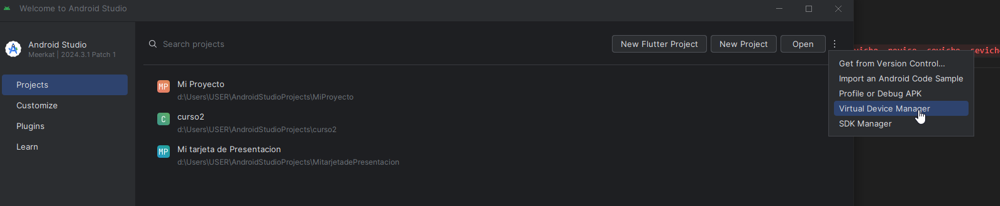

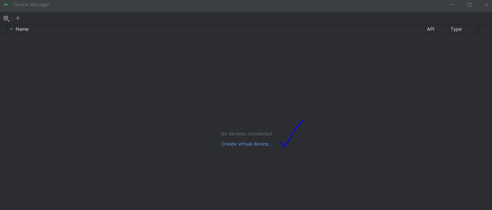

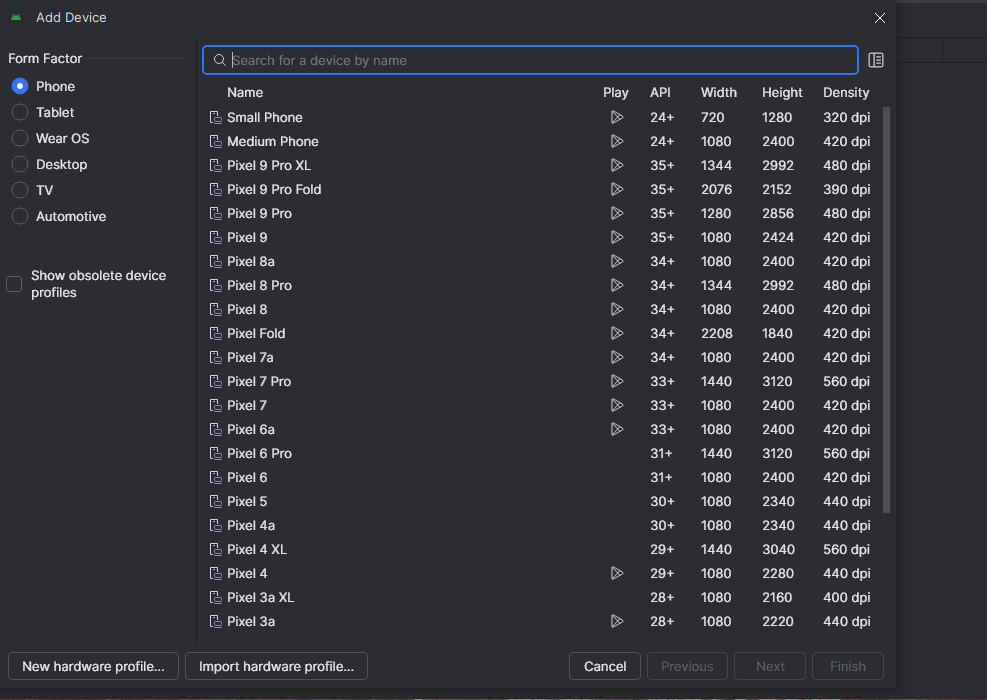

- seleccionar: new hardware profile.

ejemplo: 

- s23
- phone/tablet
- screen 6.9
- resolucion: 1440 x 3088
- ram: minimo 2 gb

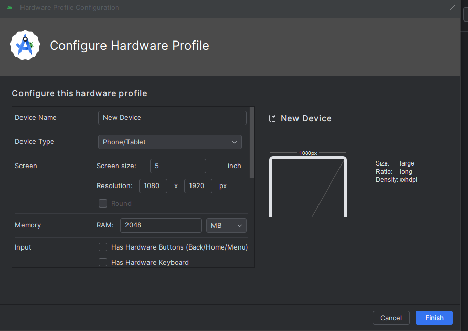

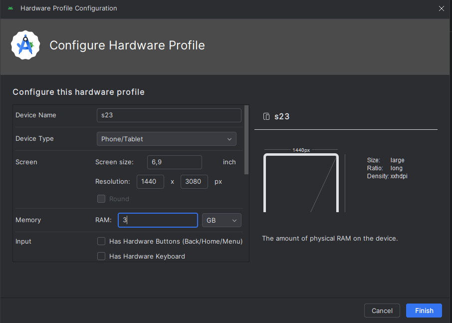

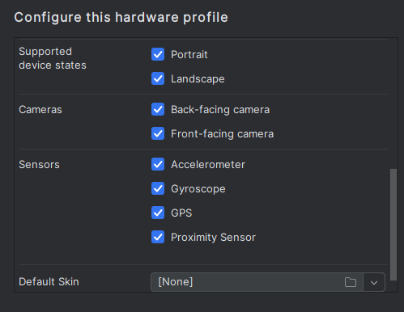

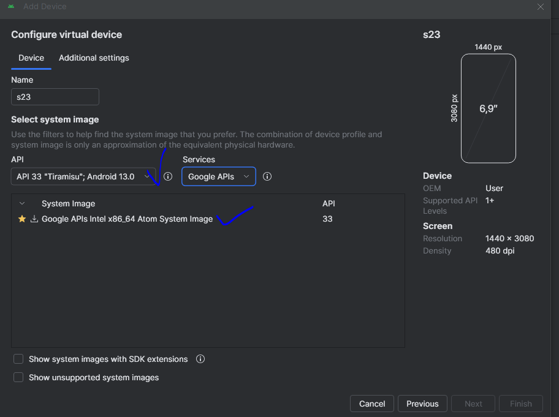

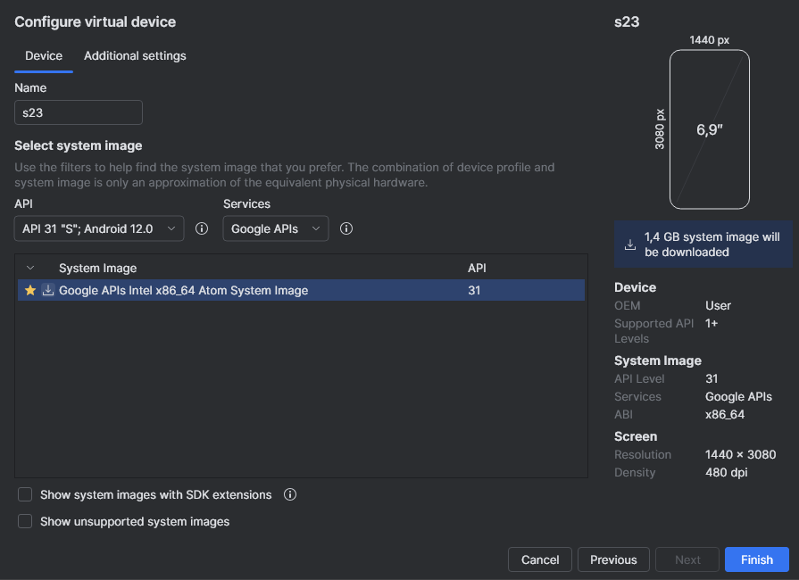

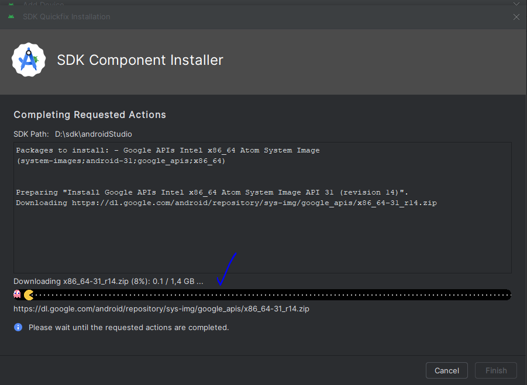

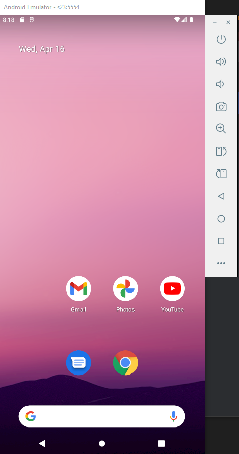

- se recomienda colocar en el nombre del emulador la api que se esta usando, en mi caso es "s23 api 31"
- tambien se recomienda activar la aceleracion grafica con hardware, en mi caso tengo una tarjeta de video nvidia, pero al activar por hardware se pone mas lento, lo dejo en automatico que está por defecto y funciona bien y rápido, con 2 gb ram

el internal storage minimo 4gb, en mi caso por defecto esta en 6gb

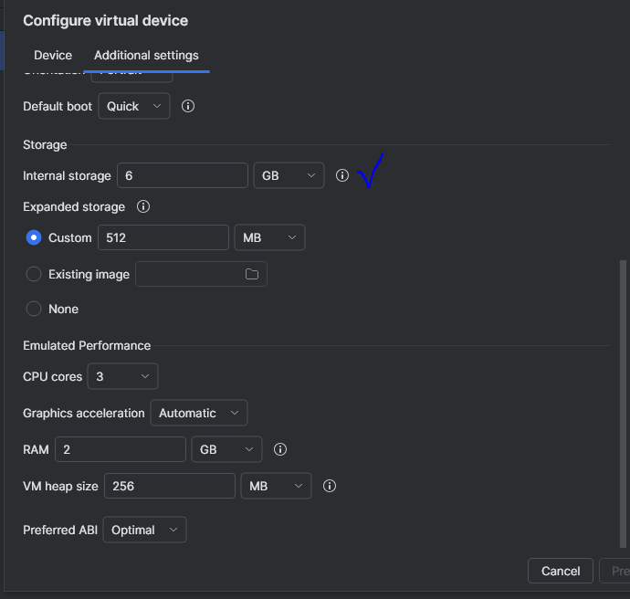