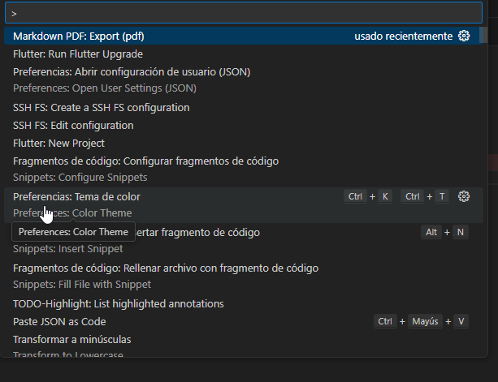
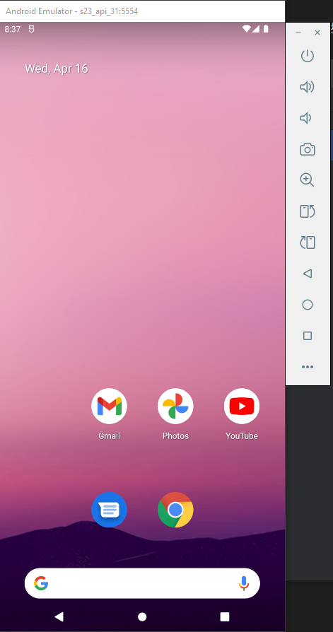
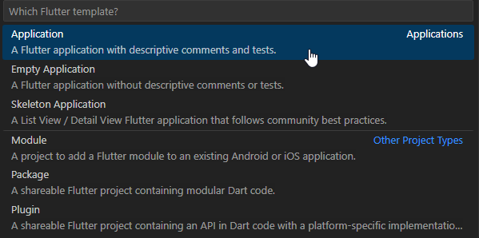
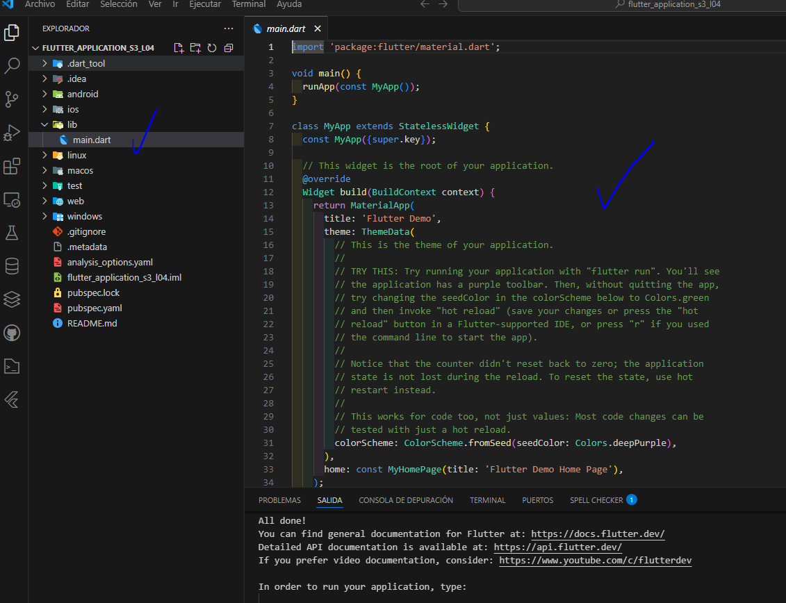
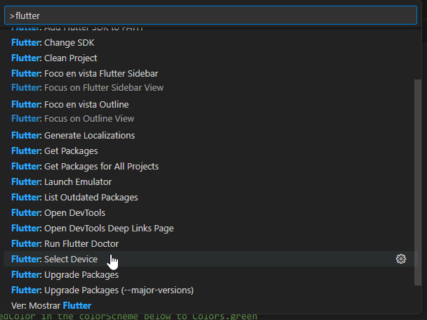
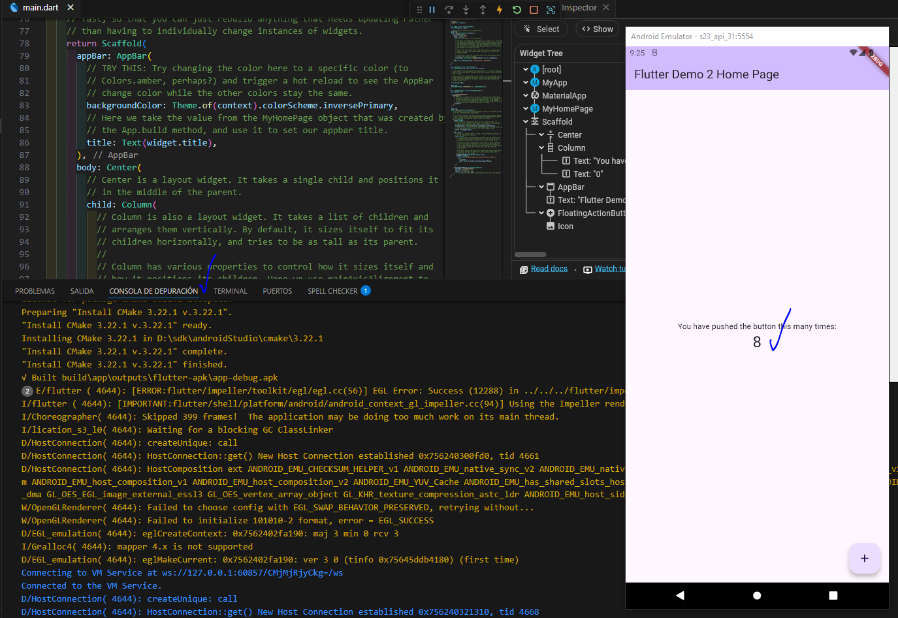

Windows: Probar dispositivo Emulado
==================================

- [S3/L04](https://www.youtube.com/watch?v=g3yz9JsRlEE&list=PLCKuOXG0bPi0sIn-nDsi7ma9OV6MEMkxj&index=34)

# Pasos

1. con vs code
2. usar el atajo `CTRL`+`SHIFT`+`P`

3. el emulador debe estar corriendo

4. con el atajo escribir flutter new project.

5. se creara una estructura de carpetas y archivos por defecto

6. luego con el atajo escribir "flutter select device"

con F5 se ejecuta la aplicacion, la primera vez se demora en arrancar, en mi caso fueron casi 10 minutos cargando las dependencias "gradle task".

