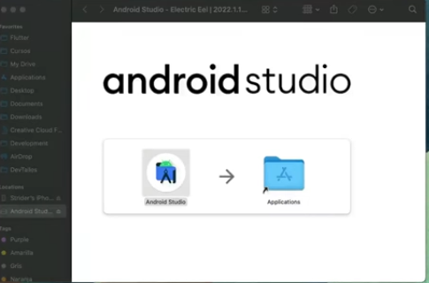
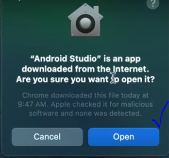
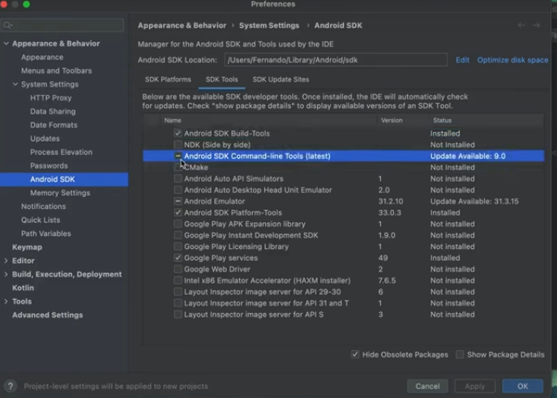

Mac Instalación Android
=======================

- [S3/L05](https://www.youtube.com/watch?v=etIOVf5d-Dg&list=PLCKuOXG0bPi0sIn-nDsi7ma9OV6MEMkxj&index=35)

# Pasos

1. Ir al sitio oficial de Android Studio
2. Seleccionar el tipo de chip usado en su mac (intel o apple chip)
3. arrastrar la carpeta descargada a la carpeta aplicaciones de apple.

4. buscar la aplicación Android Studio, dar doble click, la primera vez va a preguntar si desea ejecutar esa aplicación descargada de internet

5. se demora unos segundos mientras se configura la primera vez.
6. instalar los pluggins dart y flutter si lo desea
   
# Instalar Flutter

1. ir al sitio oficial
2. seleccionar Mac OS
3. bajar hasta encontrar install android studio
4. verificar que estén instalados android sdk, sdk command-line tools y el sdk build-tools
5. para validar que todo este ok ir a sdk manager en las opciones de inicio de android studio.
6. luego en prefererncias->android sdk, seleccionar la sdk platform mas actual, validar que esten las tres opciones necesarias activadas android sdk, sdk command-line tools y sdk build-tools

