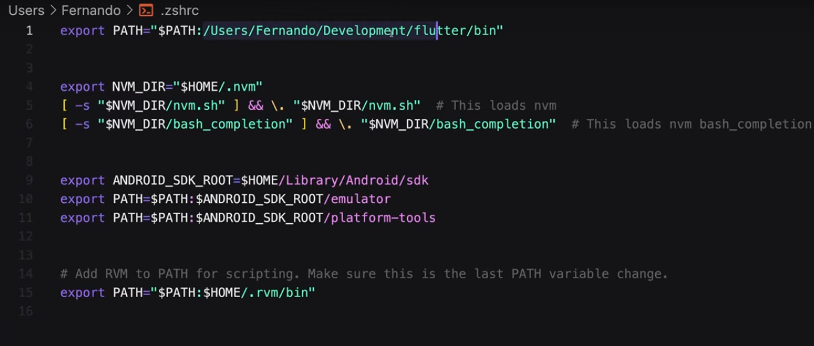
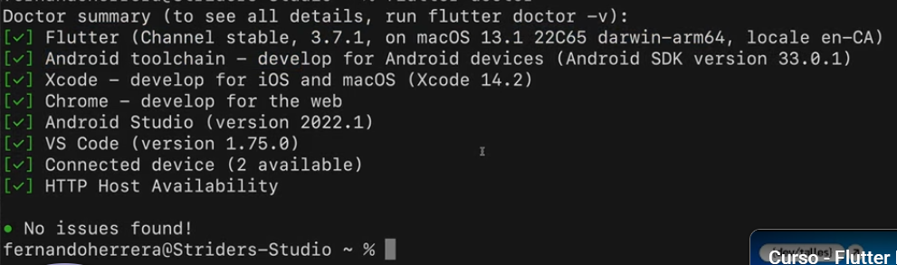

Mac Instalación de Flutter
==========================

- [S3/L06](https://www.youtube.com/watch?v=AmawKfI4eeg&list=PLCKuOXG0bPi0sIn-nDsi7ma9OV6MEMkxj&index=36)

# Pasos

1. buscar y ejecutar Xcode
2. validar que el computador tenga los requisitos minimos para instalar flutter, lo dice el sitio oficial
3. para hoy en el sitio dice sistema operativo MacOS, 2.8 gb de disco duro y Xcode instalado
4. descargar flutter
5. descomprimir
6. guardar en una carpeta que no necesite permisos de escritura, que se publica, por ejemplo en la carpeta del usuario crear una carpeta llamada development y colocar la carpeta flutter dentro.
7. se debe agregar ahora el path de donde esta flutter
8. dependiendo si su terminal corre zsfh o bash buscar en la carpeta del usuario esa carpeta oculta, se debe tener el path de donde esta el bin de flutter

9. ejecutar desde el terminal `flutter doctor`
10. resolver los errores que muestre el analisis, volver a ejecutar `flutter doctor` hasta que todo este en verde

