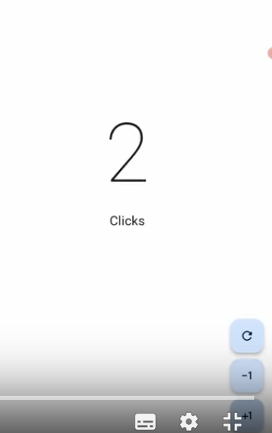

Introducción a la sección 4
===========================

- [S4/L00](https://www.youtube.com/watch?v=8zxQtgZGiY0&list=PLCKuOXG0bPi0sIn-nDsi7ma9OV6MEMkxj&index=42)

Se explica el proyecto a desarrollar

- tendrá 3 botones, +1, -1 y repetir
- contará los clicks

- se usará material 3
- se explicará como reutilizar los botones
- configuración de colores
- explicación de las carpetas y archivos de un proyecto básico