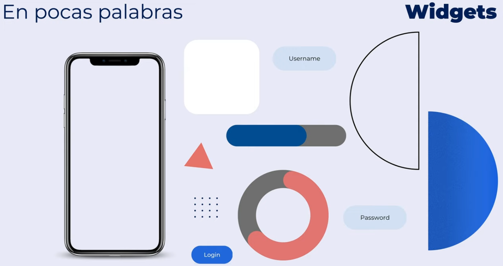
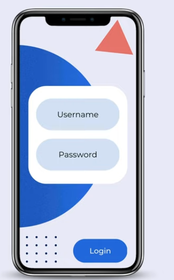
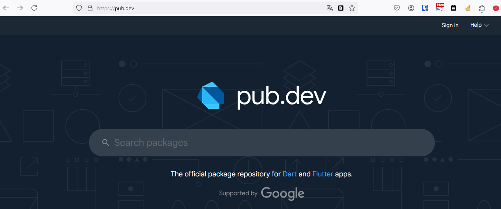

Que es Flutter
==============

- [S4/L01](https://www.youtube.com/watch?v=LpDqICMF9MM&list=PLCKuOXG0bPi0sIn-nDsi7ma9OV6MEMkxj&index=43)

- es un SDK portable
- open source framework
- ui widget library
- multiplataforma
- inspirado en react

se basa en widgets preconfigurados

- los widgets personalizados se puede empaquetar y publicar en pub.dev

- se pueden crear aplicaciones para web, windows, linux, mac, ios, y android embebido.

- el autor recomienda que se cree códigos bases para cada caso, y no uno solo código base