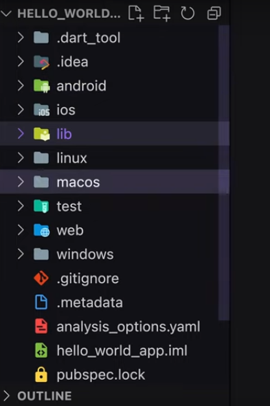

Hello world, explicando archivos y carpetas
===========================================

- [S4/L02](https://www.youtube.com/watch?v=_lYxBKZLhjU&list=PLCKuOXG0bPi0sIn-nDsi7ma9OV6MEMkxj&index=44)
- [S4/L03](https://www.youtube.com/watch?v=IAKFOL4M91w&list=PLCKuOXG0bPi0sIn-nDsi7ma9OV6MEMkxj&index=45)

- el nombre del proyecto debe ser en snake case, todo en minúscula
- se crea automáticamente la estructura, directorios y archivos, inclusive detecta en que sistema operativo se esta corriendo.

## Descripción de las carpetas

1. *.dart_tool*: se usa por pub que es un cli, da seguimiento a los paquetes, no se recomienda manipular sobre todo si no se sabe usar.
2. *.idea*: tiene las configuraciones necesarias para desarrollar con intellij idea. en nuestro caso no se esta utilizando ese editor de código
3. *android*: contiene la aplicación de android, es una carpeta macro, incluye carpetas como app, gradle
4. *ios*: contiene la aplicación de ios, para crear el xcode
5. *lib*: va a ser la carpeta mas usada en el desarrollo, contiene el código personalizado de la aplicación, por ejemplo alli esta el archivo main.dart
6. *linux*: contiene la aplicación para linux
7. *macos*: contiene la aplicación de escritorio macos
8. *test*: contiene código para realizar las pruebas o testeos de la aplicación
9. *web*: contiene el código para web
10. *windows*: contiene el código para windows

*widget* es una clase / objeto reutilizable con cierta apariencia

# Archivos en la raiz del proyecto

1. *.gitignore*: flutter por defecto crea y configura este archivo para el control de versiones con git
2. *.metadata*: seguimiento a las propiedades del proyecto, usado por flutter tools y nos ayuda a hacer comparaciones, poco probable de que se tenga que editar
3. *analysis_options.yaml*: configura el analyser, configura el linter, no se recomienda editar. asegura buenas prácticas
4. *hello_world_app.iml*: usado por intellij idea
5. *pubsec.lock*: no se edita manualmente, hace seguimiento a las versiones del proyecto, con dependencias
6. *pubsec.yaml*: importante y se debe tener en cuenta, los archivos yaml se deben editar con cuidado, los espacios, las indentaciones afectan el funcionamiento, se usa para configurar el proyecto, dependencias, define el comportamiento
7. *readme.md*: info inicial con el github