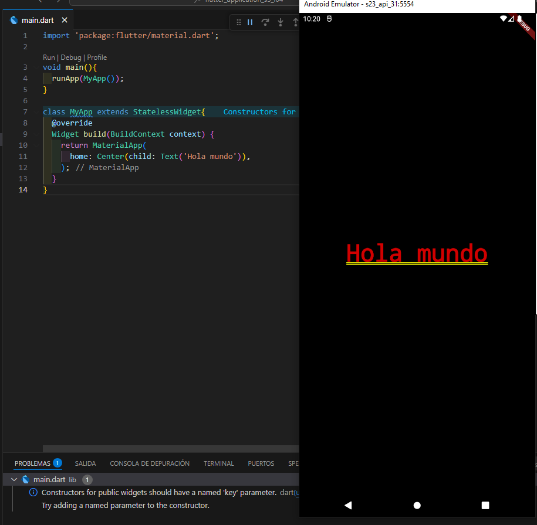

Hola Mundo
==========

- [S4/L04](https://www.youtube.com/watch?v=ZbKSqUeOSWg&list=PLCKuOXG0bPi0sIn-nDsi7ma9OV6MEMkxj&index=46)

se inicia con el archivo en lib->main.dart

## Atajos útiles

1. `CTRL` + CLICK : muestra el contenido del widget u o objeto
2. `CTRL` + `.`  : muestra las opciones rápidas para agregar código, se debe parar en el widget
3. `CTRL` + `Espaciadora` : muestra los métodos y argumentos disponibles en ese sitio del objeto

Usando el siguiente código:

```dart
import 'package:flutter/material.dart';

void main(){
  runApp(MyApp());
}

class MyApp extends StatelessWidget{
  @override
  Widget build(BuildContext context) {
    return MaterialApp(
      home: Center(child: Text('Hola mundo')),
    );
  }
}
```

