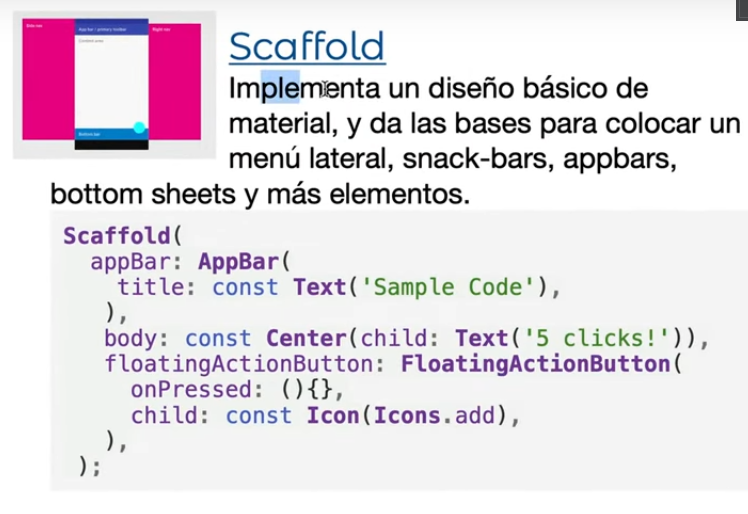
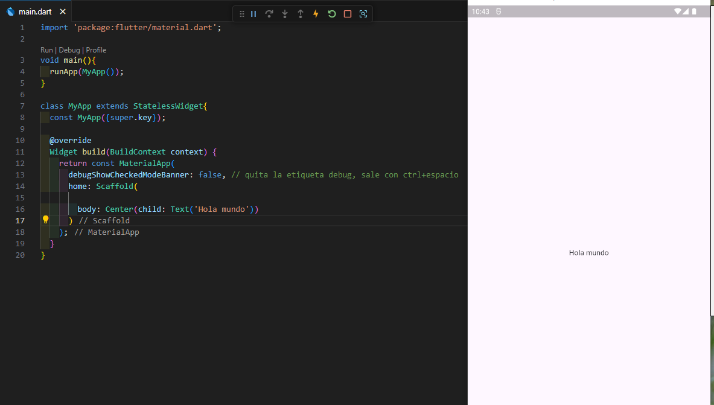

Scaffold Widget y buenas practicas
==================================

- [S4/L05](https://www.youtube.com/watch?v=YlTs80MGUHo&list=PLCKuOXG0bPi0sIn-nDsi7ma9OV6MEMkxj&index=47)





El scaffold crea las bases de la pantalla por defecto es un molde, muy util, esta en documentación.

ejemplo:

```dart
import 'package:flutter/material.dart';

void main(){
  runApp(MyApp());
}

class MyApp extends StatelessWidget{
  const MyApp({super.key});

  @override
  Widget build(BuildContext context) {
    return const MaterialApp(
      debugShowCheckedModeBanner: false, // quita la etiqueta debug, sale con ctrl+espacio
      home: Scaffold(

        body: Center(child: Text('Hola mundo'))
      )
    );
  }
}
```

