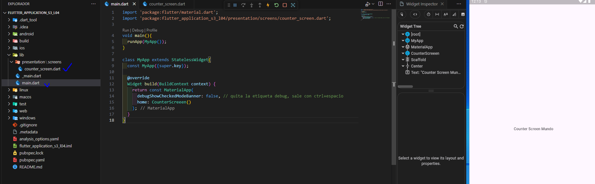

Estructura de directorios Nueva Pantalla
========================================

- [S4/L06](https://www.youtube.com/watch?v=Nc6vzLLuNIg&list=PLCKuOXG0bPi0sIn-nDsi7ma9OV6MEMkxj&index=48)

## Estructura

- no se recomienda crear todo el proyecto en main.dart
- se debe crear el file system del proyecto, esto crea controversia en la comunidad ya que puede ser complejo e incomodo
- se recomienda adoptar por ejemplo una arquitectura y aplicarla al crear el directorio

## carpeta *presentation*

- widgets personalizados
- todo lo que sea visual
- dentro de ella se recomienda usar la carpeta *screens* que contendrá las pantallas creadas, por definición es un widget que cubre toda la pantalla y debe contener su scaffolds



en la carpeta:

```dart
import 'package:flutter/material.dart';

class CounterScreeen extends StatelessWidget {
  const CounterScreeen({super.key});

  @override
  Widget build(BuildContext context) {
    return Scaffold(
      body: Center(child: Text('Counter Screen Mundo'),)
    );
  }
}
```

El main.dart se vería así:

```dart
import 'package:flutter/material.dart';
import 'package:flutter_application_s3_l04/presentation/screens/counter_screen.dart';

void main(){
  runApp(MyApp());
}

class MyApp extends StatelessWidget{
  const MyApp({super.key});

  @override
  Widget build(BuildContext context) {
    return const MaterialApp(
      debugShowCheckedModeBanner: false, // quita la etiqueta debug, sale con ctrl+espacio
      home: CounterScreeen()
    );
  }
}
```