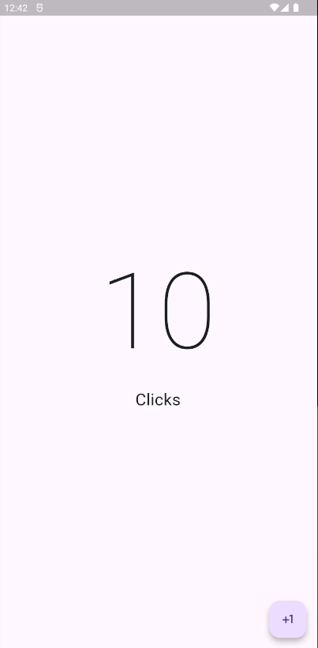

Contador, Diseño de la pantalla
================================

- [S4/L07](https://www.youtube.com/watch?v=lZ40pSFwnoM&list=PLCKuOXG0bPi0sIn-nDsi7ma9OV6MEMkxj&index=49)

se ajusta el screen:

- se ajusta el tamaño y estilo del texto
- se agrega el boton icono de +1:

```dart
import 'package:flutter/material.dart';

class CounterScreeen extends StatelessWidget {
  const CounterScreeen({super.key});

  @override
  Widget build(BuildContext context) {
    return Scaffold(
      body: 
        Center(
        child: Column(
          mainAxisAlignment: MainAxisAlignment.center,
          children: [
            Text('10', style: TextStyle(fontSize: 160, fontWeight: FontWeight.w100),),
            Text('Clicks', style: TextStyle(fontSize: 25),)
          ],
        )
        ),
        floatingActionButton: FloatingActionButton(onPressed: (){
        },
        child: Icon(Icons.plus_one),
        ));
  }
}
```

Resultado:

