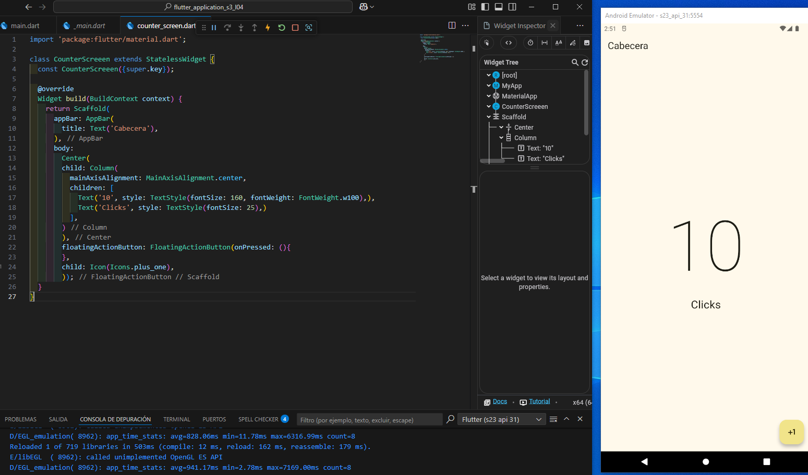

Material Design 3
===================

Material Design 3 es la última versión de Material Design, un sistema de diseño creado por Google. Esta versión se centra en la personalización y la adaptabilidad, permitiendo a los desarrolladores y diseñadores crear interfaces de usuario más flexibles y personalizadas.

- [S4/L08](https://www.youtube.com/watch?v=DmO7K0l4GKQ&list=PLCKuOXG0bPi0sIn-nDsi7ma9OV6MEMkxj&index=50)

el main:

```dart
import 'package:flutter/material.dart';
import 'package:flutter_application_s3_l04/presentation/screens/counter_screen.dart';

void main(){
  runApp(MyApp());
}

class MyApp extends StatelessWidget{
  const MyApp({super.key});

  @override
  Widget build(BuildContext context) {
    return MaterialApp(
      debugShowCheckedModeBanner: false, // quita la etiqueta debug, sale con ctrl+espacio
      theme: ThemeData(
        useMaterial3: true,
        colorSchemeSeed: Colors.yellow
      ),
      home: const CounterScreeen()
    );
  }
}
```

el screen:

```dart
import 'package:flutter/material.dart';

class CounterScreeen extends StatelessWidget {
  const CounterScreeen({super.key});

  @override
  Widget build(BuildContext context) {
    return Scaffold(
      appBar: AppBar(
        title: Text('Cabecera'),
      ),
      body: 
        Center(
        child: Column(
          mainAxisAlignment: MainAxisAlignment.center,
          children: [
            Text('10', style: TextStyle(fontSize: 160, fontWeight: FontWeight.w100),),
            Text('Clicks', style: TextStyle(fontSize: 25),)
          ],
        )
        ),
        floatingActionButton: FloatingActionButton(onPressed: (){
        },
        child: Icon(Icons.plus_one),
        ));
  }
}
```

El resultado:

