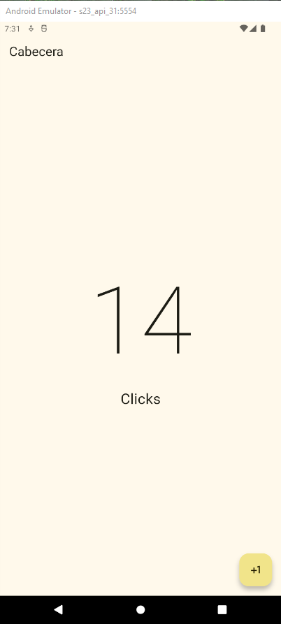

Cambiar el estado de la aplicación
==================================

- [S4/L09](https://www.youtube.com/watch?v=aFQ6bglbTek&list=PLCKuOXG0bPi0sIn-nDsi7ma9OV6MEMkxj&index=51)

## Pasos

1. el statelesswidget no tiene estado, por lo que no puede cambiar su estado. Para cambiar el estado de la aplicación, se debe usar un StatefulWidget.
2. el StatefulWidget tiene un estado mutable, lo que significa que puede cambiar su estado en tiempo de ejecución.
3. una vez cambiado se puede crear la variable por ejemplo counterClick y se le asigna el valor 0.
4. al presionar el boton se incrementa el valor de la variable counterClick en 1.
5. luego para volver a renderizar el widget se debe usar el setState para que el widget vuelva a renderizarse con el nuevo valor de la variable counterClick.

main:dart

```dart
import 'package:flutter/material.dart';
import 'package:flutter_application_s3_l04/presentation/screens/counter_screen.dart';

void main(){
  runApp(MyApp());
}

class MyApp extends StatelessWidget{
  const MyApp({super.key});

  @override
  Widget build(BuildContext context) {
    return MaterialApp(
      debugShowCheckedModeBanner: false, // quita la etiqueta debug, sale con ctrl+espacio
      theme: ThemeData(
        useMaterial3: true,
        colorSchemeSeed: Colors.yellow
      ),
      home: const CounterScreeen()
    );
  }
}
```

el screen:

```dart
import 'package:flutter/material.dart';

class CounterScreeen extends StatefulWidget {
  const CounterScreeen({super.key});

  @override
  State<CounterScreeen> createState() => _CounterScreeenState();
}

class _CounterScreeenState extends State<CounterScreeen> {
  
  int clickCounter=0;
  @override
  Widget build(BuildContext context) {
    return Scaffold(
      appBar: AppBar(
        title: Text('Cabecera'),
      ),
      body: 
        Center(
        child: Column(
          mainAxisAlignment: MainAxisAlignment.center,
          children: [
            Text('$clickCounter', style: TextStyle(fontSize: 160, fontWeight: FontWeight.w100),),
            const Text('Clicks', style: TextStyle(fontSize: 25),)
          ],
        )
        ),
        floatingActionButton: FloatingActionButton(onPressed: (){
          clickCounter++;
          setState(() {
            
          });
        },
        child: Icon(Icons.plus_one),
        ));
  }
}
```

resultado:

- al presionar el botón se incrementa el valor de la variable clickCounter en 1 y se vuelve a renderizar el widget con el nuevo valor de la variable clickCounter.


