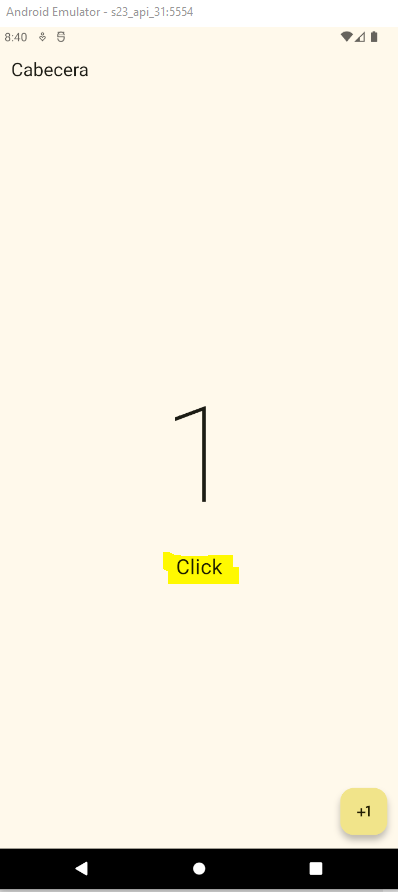

Cambiar la palabra clicks:
=========================

- [S4/L10](https://www.youtube.com/watch?v=HQHP1uczwv4&list=PLCKuOXG0bPi0sIn-nDsi7ma9OV6MEMkxj&index=52)

## Pasos

1. se usa el operador ternario para cambiar la palabra clicks por click en el caso de que el valor sea 1, de lo contrario se deja la palabra clicks.
2. se puede usar if() pero dentro del widget solo se puede usar if() sin los else.

## main.dart

```dart
import 'package:flutter/material.dart';
import 'package:flutter_application_s3_l04/presentation/screens/counter_screen.dart';

void main(){
  runApp(MyApp());
}

class MyApp extends StatelessWidget{
  const MyApp({super.key});

  @override
  Widget build(BuildContext context) {
    return MaterialApp(
      debugShowCheckedModeBanner: false, // quita la etiqueta debug, sale con ctrl+espacio
      theme: ThemeData(
        useMaterial3: true,
        colorSchemeSeed: Colors.yellow
      ),
      home: const CounterScreeen()
    );
  }
}
```

## screen

```dart
import 'package:flutter/material.dart';

class CounterScreeen extends StatefulWidget {
  const CounterScreeen({super.key});

  @override
  State<CounterScreeen> createState() => _CounterScreeenState();
}

class _CounterScreeenState extends State<CounterScreeen> {
  
  int clickCounter=0;

  @override

  Widget build(BuildContext context) {
    return Scaffold(
      appBar: AppBar(
        title: Text('Cabecera'),
      ),
      body: 
        Center(
        child: Column(
          mainAxisAlignment: MainAxisAlignment.center,
          children: [
            Text('$clickCounter', style: TextStyle(fontSize: 160, fontWeight: FontWeight.w100),),
            Text('Click${ clickCounter == 1 ? '':'s'}', style: TextStyle(fontSize: 25),)

            // otra forma con if(). pero dentro del widget solo se puede hacer if sin else
            // if(clickCounter == 1) Text('Click', style: TextStyle(fontSize: 25) )
            // if(clickCounter != 1) Text('Clicks', style: TextStyle(fontSize: 25) )
          ],
        )
        ),
        floatingActionButton: FloatingActionButton(onPressed: (){
          clickCounter++;
          
          
          setState(() {
            
            
          });
        },
        child: Icon(Icons.plus_one),
        ));
  }
}
```

## Resultado

