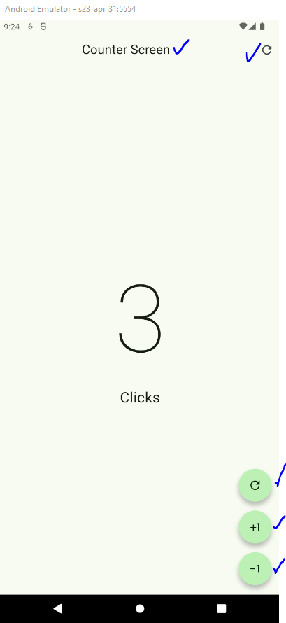

AppBar y Acciones
===================

- [S4/L11](https://www.youtube.com/watch?v=JSSCtHVqj1c&list=PLCKuOXG0bPi0sIn-nDsi7ma9OV6MEMkxj&index=53)

## main

```dart
import 'package:flutter/material.dart';
import 'package:flutter_application_s3_l04/presentation/screens/counter_functions_screen.dart';

void main(){
  runApp(MyApp());
}

class MyApp extends StatelessWidget{
  const MyApp({super.key});

  @override
  Widget build(BuildContext context) {
    return MaterialApp(
      debugShowCheckedModeBanner: false, // quita la etiqueta debug, sale con ctrl+espacio
      theme: ThemeData(
        useMaterial3: true,
        colorSchemeSeed: Colors.green
      ),
      home: const CounterFunctionsScreeen()
    );
  }
}
```

## screeen nuevo llamado CounterFunctionsScreen

```dart
import 'package:flutter/material.dart';

class CounterFunctionsScreeen extends StatefulWidget {
  const CounterFunctionsScreeen({super.key});

  @override
  State<CounterFunctionsScreeen> createState() => _CounterFunctionsScreeenState();
}

class _CounterFunctionsScreeenState extends State<CounterFunctionsScreeen> {
  
  int clickCounter=0;

  @override

  Widget build(BuildContext context) {
    return Scaffold(
      appBar: AppBar(
        title: Center(child: Text('Counter Screen')),
        actions: [
          IconButton(
            onPressed: (){
            setState(() {
              clickCounter=0;
            });
          }, 
            icon: Icon(Icons.refresh_rounded)),
            ],
      ),
      body: 
        Center(
        child: Column(
          mainAxisAlignment: MainAxisAlignment.center,
          children: [
            Text('$clickCounter', style: TextStyle(fontSize: 160, fontWeight: FontWeight.w100),),
            Text('Click${ clickCounter == 1 ? '':'s'}', style: TextStyle(fontSize: 25),)
          ],
        )
        ),
        floatingActionButton: 
          Column(
            mainAxisAlignment: MainAxisAlignment.end,
            children: [
              FloatingActionButton(
                shape: StadiumBorder(),
                onPressed: ()
              {
                clickCounter=0;
                setState(() {});
              },
                child: Icon(Icons.refresh_outlined),),
              SizedBox(height: 15,),
              FloatingActionButton(
                shape: StadiumBorder(),
                onPressed: ()
              {
                clickCounter++;
                setState(() {});
              },
                child: Icon(Icons.plus_one),),

              SizedBox(height: 15,),
              FloatingActionButton(
                shape: StadiumBorder(),
                onPressed: ()
              {
                clickCounter--;
                setState(() {});
              },
                child: Icon(Icons.exposure_minus_1_outlined),),
            ],
          )
          );   
  }
}
```

## Resultado

