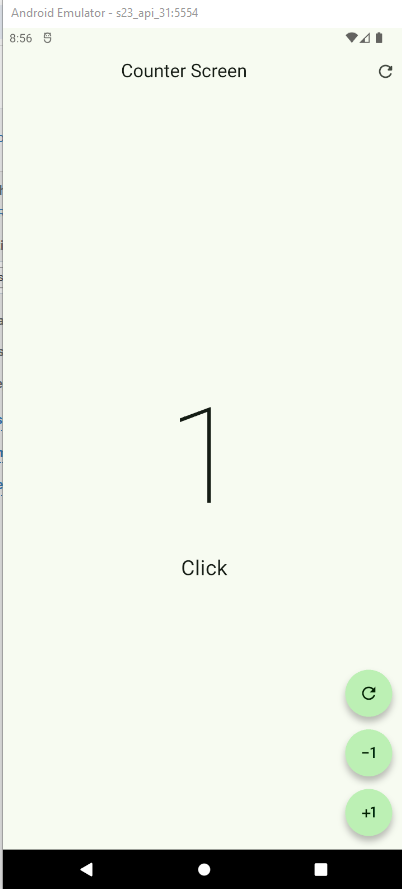

Widgets personalizados
========================

- [S4/L12](https://www.youtube.com/watch?v=FpQ6-bTyhBo&list=PLCKuOXG0bPi0sIn-nDsi7ma9OV6MEMkxj&index=54)

## Tomar en cuenta antes de empezar

- No se puede usar el mismo nombre de un widget ya existente.
- El widget no debe tener dependencias al crearlo a partir de uno existente con `CTRL` + `.` para extraer el widget.

## ejemplo el screen:

```dart
import 'package:flutter/material.dart';

class CounterFunctionsScreeen extends StatefulWidget {
  const CounterFunctionsScreeen({super.key});

  @override
  State<CounterFunctionsScreeen> createState() => _CounterFunctionsScreeenState();
}

class _CounterFunctionsScreeenState extends State<CounterFunctionsScreeen> {
  
  int clickCounter=0;

  @override

  Widget build(BuildContext context) {
    return Scaffold(
      appBar: AppBar(
        title: Center(child: Text('Counter Screen')),
        actions: [
          IconButton(
            onPressed: (){
            setState(() {
              clickCounter=0;
            });
          }, 
            icon: Icon(Icons.refresh_rounded)),
            ],
      ),
      body: 
        Center(
        child: Column(
          mainAxisAlignment: MainAxisAlignment.center,
          children: [
            Text('$clickCounter', style: TextStyle(fontSize: 160, fontWeight: FontWeight.w100),),
            Text('Click${ clickCounter == 1 ? '':'s'}', style: TextStyle(fontSize: 25),)
          ],
        )
        ),
        floatingActionButton: 
          Column(
            mainAxisAlignment: MainAxisAlignment.end,
            children: [
              
              CustomButton(icon: Icons.refresh_outlined),

              SizedBox(height: 15,), 
              CustomButton(icon: Icons.exposure_minus_1_outlined),

              SizedBox(height: 15,),
              CustomButton(icon: Icons.plus_one),
            ],
          )
          );   
  }
}

class CustomButton extends StatelessWidget {

  final IconData icon;
  
  const CustomButton({
    super.key, 
    required this.icon,
  });

  @override
  Widget build(BuildContext context) {
    return FloatingActionButton(
      shape: StadiumBorder(),
      onPressed: ()
    {
      
    },
      child: Icon(icon),);
  }
}
```

## Resultado:



- solo estan los botones usando un widget personalizado, pero no tienen funcionalidad aun.
- el widget personalizado es el `CustomButton` que es un `StatelessWidget` que recibe un `IconData` como argumento y lo muestra en un `FloatingActionButton` con forma de `StadiumBorder()`.    