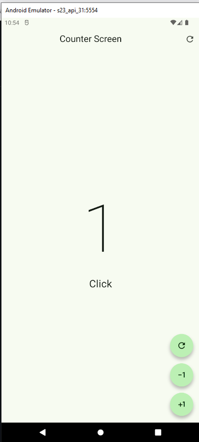

VoidCallback Funcion como argumento
===================================

- [S4/L13](https://www.youtube.com/watch?v=C2XX8nYT7h0&list=PLCKuOXG0bPi0sIn-nDsi7ma9OV6MEMkxj&index=55)

## Opciones a tomar en cuenta:

1. *shape: const StadiumBorder()* // si lo desactivo entonces se muestran los botones cuadrados.
2. *enableFeedback: true* // si lo desactivo entonces no se muestra el efecto de presionar el botón. efecto acústico.
3. *elevation: 0* // si lo desactivo entonces se muestra la sombra del botón. (sombra de la parte inferior del botón). un buen valor es 5
4. *backgroundColor: Colors.red* // si lo desactivo entonces se muestra el color por defecto del botón. (color de fondo del botón). un buen valor es Colors.blue


# main.dart

```dart
import 'package:flutter/material.dart';
import 'package:flutter_application_s3_l04/presentation/screens/counter_functions_screen.dart';

void main(){
  runApp(MyApp());
}

class MyApp extends StatelessWidget{
  const MyApp({super.key});

  @override
  Widget build(BuildContext context) {
    return MaterialApp(
      debugShowCheckedModeBanner: false, // quita la etiqueta debug, sale con ctrl+espacio
      theme: ThemeData(
        useMaterial3: true,
        colorSchemeSeed: Colors.green
      ),
      home: const CounterFunctionsScreeen()
    );
  }
}
```

# el screen:

```dart
import 'package:flutter/material.dart';

class CounterFunctionsScreeen extends StatefulWidget {
  const CounterFunctionsScreeen({super.key});

  @override
  State<CounterFunctionsScreeen> createState() => _CounterFunctionsScreeenState();
}

class _CounterFunctionsScreeenState extends State<CounterFunctionsScreeen> {
  
  int clickCounter=0;

  @override

  Widget build(BuildContext context) {
    return Scaffold(
      appBar: AppBar(
        title: Center(child: Text('Counter Screen')),
        actions: [
          IconButton(
            onPressed: (){
            setState(() {
              clickCounter=0;
            });
          }, 
            icon: Icon(Icons.refresh_rounded)),
            ],
      ),
      body: 
        Center(
        child: Column(
          mainAxisAlignment: MainAxisAlignment.center,
          children: [
            Text('$clickCounter', style: TextStyle(fontSize: 160, fontWeight: FontWeight.w100),),
            Text('Click${ clickCounter == 1 ? '':'s'}', style: TextStyle(fontSize: 25),)
          ],
        )
        ),
        floatingActionButton: 
          Column(
            mainAxisAlignment: MainAxisAlignment.end,
            children: [
              
              CustomButton(
                icon: Icons.refresh_outlined,
                onPressed: () {
                  clickCounter=0;
                  setState(() {
                    
                  });
                },),

              SizedBox(height: 15,), 
              CustomButton(
                icon: Icons.exposure_minus_1_outlined,
                onPressed: () {
                  if(clickCounter==0) return;
                  clickCounter--;
                  setState(() {
                    
                  });
                },),

              SizedBox(height: 15,),
              CustomButton(
                icon: Icons.plus_one,
                onPressed: () {
                  clickCounter++;
                  setState(() {
                    
                  });
                },),
            ],
          )
          );   
  }
}

class CustomButton extends StatelessWidget {

  final IconData icon;
  final VoidCallback? onPressed;
  
  const CustomButton({
    super.key, 
    required this.icon, 
    this.onPressed,
  });

  @override
  Widget build(BuildContext context) {
    return FloatingActionButton(
      shape: StadiumBorder(),
      onPressed: onPressed,
      child: Icon(icon),);
  }
}
```

# Resultado: 

