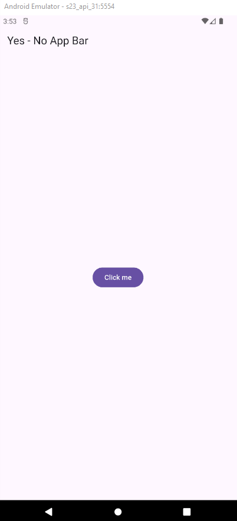

Inicio de App YesNo App
========================

- [S5/L01](https://www.youtube.com/watch?v=tvd014jvMHw&list=PLCKuOXG0bPi0sIn-nDsi7ma9OV6MEMkxj&index=57)

## Usando un snippet de código

- mateapp

## main

```dart
import 'package:flutter/material.dart';

void main() => runApp(const MyApp());

class MyApp extends StatelessWidget {
  const MyApp({super.key});

  @override
  Widget build(BuildContext context) {
    return MaterialApp(
      title: 'Material App',
      debugShowCheckedModeBanner: false,
      home: Scaffold(
        appBar: AppBar(
          title: const Text('Yes - No App Bar'),
        ),
        body: Center(
          child: FilledButton(onPressed: (){}, child: Text('Click me')),
        ),
      ),
    );
  }
}
```

## Resultado



