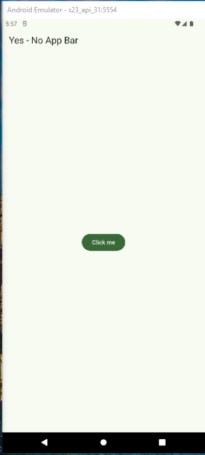

Estilo global de la aplicación
==============================

- [S5/L02](https://www.youtube.com/watch?v=klAnLazNmqg&list=PLCKuOXG0bPi0sIn-nDsi7ma9OV6MEMkxj&index=58)

## Recomendaciones

1. crear un archivo con las características del tema de la aplicacion
2. crear la estructura de carpetas y archivos para el tema de la aplicacion
3. por ejemplo la carpeta `lib/config` y dentro de ella crear la carpeta `theme` y dentro de ella crear el archivo `app_theme.dart`
4. se usan asersiones para verificar que el tema de la aplicacion es correcto

## Main

```dart
import 'package:flutter/material.dart';
import 'package:yes_no_app/config/theme/app_theme.dart';

void main() => runApp(const MyApp());

class MyApp extends StatelessWidget {
  const MyApp({super.key});

  @override
  Widget build(BuildContext context) {
    return MaterialApp(
      title: 'Material App',
      debugShowCheckedModeBanner: false,
      theme: AppTheme().theme(selectedColor: -1),
      home: Scaffold(
        appBar: AppBar(
          title: const Text('Yes - No App Bar'),
        ),
        body: Center(
          child: FilledButton(onPressed: (){}, child: Text('Click me')),
        ),
      ),
    );
  }
}
```

## App Theme

```dart
import 'package:flutter/material.dart';


const Color _customColor=Color(0xFF49149F);
const List<Color> _colorThemes =[

  _customColor,
  Colors.blue,
  Colors.teal,
  Colors.green,
  Colors.yellow,
  Colors.orange,
  Colors.pink,
  Colors.black,

];

// usando las aserciones:

class AppTheme {
  
  final int selectedColor;

  AppTheme({
      this.selectedColor=0
    })
    :assert(selectedColor>=0 && selectedColor <= _colorThemes.length-1, 'error, color del tema entre 0 y ${_colorThemes.length}');

  ThemeData theme({required int selectedColor}){
    return ThemeData(
      useMaterial3: true,
      colorSchemeSeed: _colorThemes[selectedColor]
    );
  }
}
```

## Resultado



