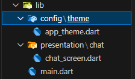

Chat Screen
================

- [S5/L03](https://www.youtube.com/watch?v=FCmDDZakutQ&list=PLCKuOXG0bPi0sIn-nDsi7ma9OV6MEMkxj&index=59)

## Directorio de la app



## Main

```dart
import 'package:flutter/material.dart';
import 'package:yes_no_app/config/theme/app_theme.dart';
import 'package:yes_no_app/presentation/chat/chat_screen.dart';

void main() => runApp(const MyApp());

class MyApp extends StatelessWidget {
  const MyApp({super.key});

  @override
  Widget build(BuildContext context) {
    return MaterialApp(
      title: 'Material App',
      debugShowCheckedModeBanner: false,
      theme: AppTheme().theme(selectedColor: 3),
      home: ChatScreen()
    );
  }
}
```

## Presentación

```dart
import 'package:flutter/material.dart';

class ChatScreen extends StatelessWidget {
  const ChatScreen({super.key});

  @override
  Widget build(BuildContext context) {
    return Scaffold(
      appBar: AppBar(
        leading: Padding(
          padding: const EdgeInsets.all(4.0),
          child: CircleAvatar(
            backgroundImage: NetworkImage('https://www.univision.com/proxy/api/cached/picture?href=https%3A%2F%2Fst1.uvnimg.com%2F1a%2F02%2Fd738ea9d4bbfaefdc4545df7deab%2F8adbe0d93b6340b7a21a60d0a17aa019&width=190&height=250&ratio_width=303&ratio_height=303&resize_option=Fill%20Area'),
          ),
        ),
        title: Text('Mi amor 💓'),
        centerTitle: false,
      ),
    );
  }
}
```

## Resultados


