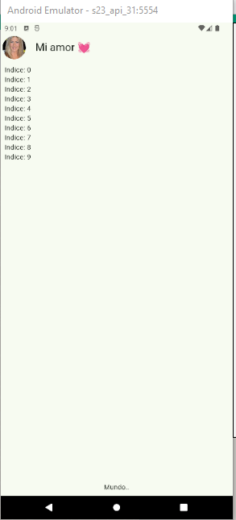

ListView | Area de los mensajes
===============================

- [S5/L04](https://www.youtube.com/watch?v=Jj5S6xGZIUg&list=PLCKuOXG0bPi0sIn-nDsi7ma9OV6MEMkxj&index=60)

## Chat view

```dart
import 'package:flutter/material.dart';

class ChatScreen extends StatelessWidget {
  const ChatScreen({super.key});

  @override
  Widget build(BuildContext context) {
    return Scaffold(
      appBar: AppBar(
        leading: Padding(
          padding: const EdgeInsets.all(4.0),
          child: CircleAvatar(
            backgroundImage: NetworkImage('https://www.univision.com/proxy/api/cached/picture?href=https%3A%2F%2Fst1.uvnimg.com%2F1a%2F02%2Fd738ea9d4bbfaefdc4545df7deab%2F8adbe0d93b6340b7a21a60d0a17aa019&width=190&height=250&ratio_width=303&ratio_height=303&resize_option=Fill%20Area'),
          ),
        ),
        title: Text('Mi amor 💓'),
        centerTitle: false,
      ),
      body: _Chatview(),
    );
  }
}

class _Chatview extends StatelessWidget {
  const _Chatview();

  @override
  Widget build(BuildContext context) {
    return SafeArea(
      child: Padding(
        padding: const EdgeInsets.all(8.0),
        child: Column(
          children: [
            Expanded(
              child: ListView.builder(
                itemCount: 10,
                itemBuilder: (context, index){
                return Text('Indice: $index');
              })
              ),
            
            Text('Mundo..')
          ],
        ),
      ),
    );
  }
}
```

## Resultado

