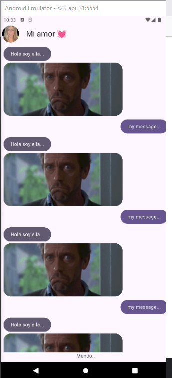

Mensajes de ella burbuja de chat
=================================


- [S5/L06](https://www.youtube.com/watch?v=noHfqtdsNLs&list=PLCKuOXG0bPi0sIn-nDsi7ma9OV6MEMkxj&index=62)

## El Screen

```dart
import 'package:flutter/material.dart';
import 'package:yes_no_app/presentation/widgets/chat/her_message_bubble.dart';
import 'package:yes_no_app/presentation/widgets/chat/my_message_bubble.dart';

class ChatScreen extends StatelessWidget {
  const ChatScreen({super.key});

  @override
  Widget build(BuildContext context) {
    return Scaffold(
      appBar: AppBar(
        leading: Padding(
          padding: const EdgeInsets.all(4.0),
          child: CircleAvatar(
            backgroundImage: NetworkImage('https://www.univision.com/proxy/api/cached/picture?href=https%3A%2F%2Fst1.uvnimg.com%2F1a%2F02%2Fd738ea9d4bbfaefdc4545df7deab%2F8adbe0d93b6340b7a21a60d0a17aa019&width=190&height=250&ratio_width=303&ratio_height=303&resize_option=Fill%20Area'),
          ),
        ),
        title: Text('Mi amor 💓'),
        centerTitle: false,
      ),
      body: _Chatview(),
    );
  }
}

class _Chatview extends StatelessWidget {
  const _Chatview();

  @override
  Widget build(BuildContext context) {
    return SafeArea(
      child: Padding(
        padding: const EdgeInsets.all(8.0),
        child: Column(
          children: [
            Expanded(
              child: ListView.builder(
                itemCount: 100,
                itemBuilder: (context, index){
                return (index % 2 == 0) ? HerMessageBubble()
                                        : MyMessageBubble();
              })
              ),
            
            Text('Mundo..')
          ],
        ),
      ),
    );
  }
}
```

## HerMessageBubble

```dart
import 'package:flutter/material.dart';

class HerMessageBubble extends StatelessWidget {
  const HerMessageBubble({super.key});

  @override
  Widget build(BuildContext context) {
    final colors = Theme.of(context).colorScheme;

    return Column(
      crossAxisAlignment: CrossAxisAlignment.start,
      children: [
        Container(
          decoration: BoxDecoration(
            color: colors.secondary,
            borderRadius: BorderRadius.circular(20),
          ),
          child: Padding(
            padding: const EdgeInsets.symmetric(horizontal: 20, vertical: 10),
            child: Text('Hola soy ella...', style: TextStyle(color: Colors.white)),
          ),
        ),
        SizedBox(height: 5),
        _ImageBubble(),
        SizedBox(height: 10,)
      ],
    );
  }
}

class _ImageBubble extends StatelessWidget {
  
  @override
  Widget build(BuildContext context) {

    final size = MediaQuery.of(context).size;
    
    return ClipRRect(
      borderRadius: BorderRadius.circular(20),
      child: Image.network('https://yesno.wtf/assets/yes/3-422e51268d64d78241720a7de52fe121.gif',
              width: size.width * 0.7,
              height: 150,
              fit: BoxFit.cover,
      ),
      
    );
      
  }
}
```

## Resultado

