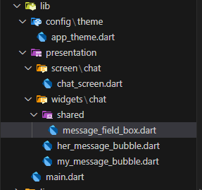
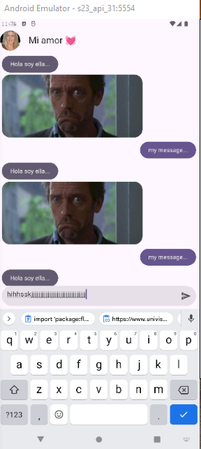

TextFormField
==============

- [S5/L08](https://www.youtube.com/watch?v=T3OR7CrN9zE&list=PLCKuOXG0bPi0sIn-nDsi7ma9OV6MEMkxj&index=64)

El widget `TextFormField` es un campo de texto que se utiliza para la entrada de datos en formularios. Es una subclase de `TextField` y proporciona funcionalidades adicionales para la validación y el manejo de formularios.

## Nueva archivo: `message_field_box.dart`




## Caja de texto

```dart
import 'package:flutter/material.dart';

class MessageFieldBox extends StatelessWidget {
  const MessageFieldBox({super.key});

  @override
  Widget build(BuildContext context) {

    final outlineInputBorder= UnderlineInputBorder(
      borderSide: BorderSide( color: Colors.transparent),
      borderRadius: BorderRadius.circular(40)
    );

    final inputDecoration = InputDecoration(
        enabledBorder: outlineInputBorder,
        focusedBorder: outlineInputBorder,
        filled: true,
        suffixIcon: IconButton(
          onPressed: (){
            print('valor de la caja de texto');
          },
          icon: Icon(Icons.send_outlined))
      );

    return TextFormField(
      decoration: inputDecoration,
      onFieldSubmitted: (value) {
        print('submit value $value');
      },
    );
  }
}
```


## Pantalla de chat

```dart
import 'package:flutter/material.dart';
import 'package:yes_no_app/presentation/widgets/chat/her_message_bubble.dart';
import 'package:yes_no_app/presentation/widgets/chat/my_message_bubble.dart';
import 'package:yes_no_app/presentation/widgets/chat/shared/message_field_box.dart';

class ChatScreen extends StatelessWidget {
  const ChatScreen({super.key});

  @override
  Widget build(BuildContext context) {
    return Scaffold(
      appBar: AppBar(
        leading: Padding(
          padding: const EdgeInsets.all(4.0),
          child: CircleAvatar(
            backgroundImage: NetworkImage('https://www.univision.com/proxy/api/cached/picture?href=https%3A%2F%2Fst1.uvnimg.com%2F1a%2F02%2Fd738ea9d4bbfaefdc4545df7deab%2F8adbe0d93b6340b7a21a60d0a17aa019&width=190&height=250&ratio_width=303&ratio_height=303&resize_option=Fill%20Area'),
          ),
        ),
        title: Text('Mi amor 💓'),
        centerTitle: false,
      ),
      body: _Chatview(),
    );
  }
}

class _Chatview extends StatelessWidget {
  const _Chatview();

  @override
  Widget build(BuildContext context) {
    return SafeArea(
      child: Padding(
        padding: const EdgeInsets.all(8.0),
        child: Column(
          children: [
            Expanded(
              child: ListView.builder(
                itemCount: 100,
                itemBuilder: (context, index){
                return (index % 2 == 0) ? HerMessageBubble()
                                        : MyMessageBubble();
              })
              ),
            
            /// caja de texto
            MessageFieldBox()
          ],
        ),
      ),
    );
  }
}
```

## Resultado:

